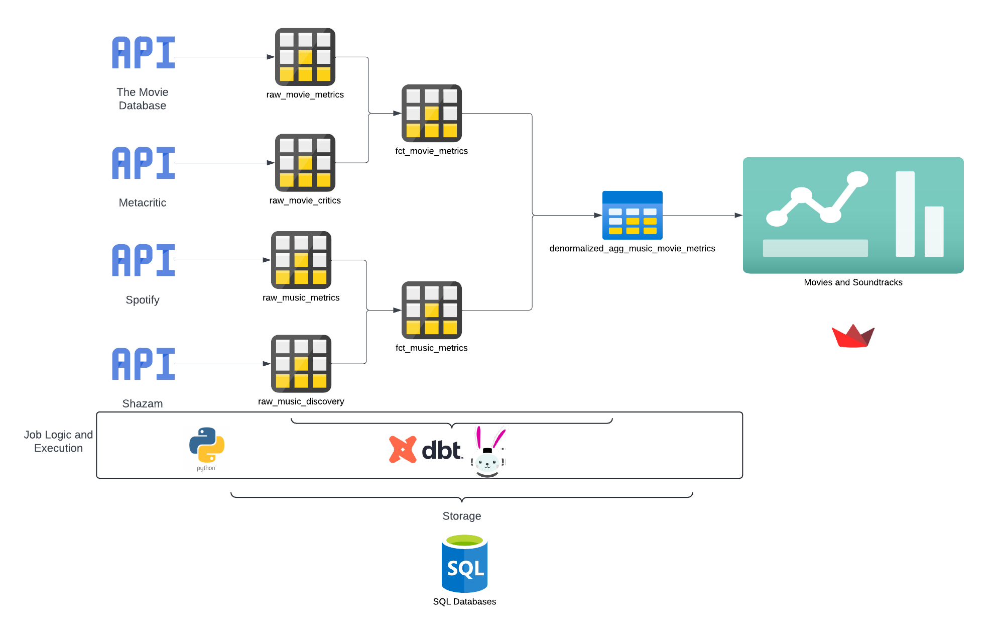

# Introduction

## Background

Shout out to a stranger’s curiosity on this project. I saw a tweet once (which I can’t find right now) that was asking if a movie’s success is tied to its soundtrack popularity. Now personally, I can think of movies i only watch for the soundtrack and if that event of watching the movie is attributable to popularity and in turn success of a film, then wouldn’t it be interesting to find out - in hindsight - how different movies and their soundtracks compare in terms of popularity? Imagine a time before music apps, before Napster - you would either have to hope the movie studio releases a soundtrack record or just watch the movie over and over again. That is the whole premise of this project!

## Technical Approach

### Data Sources

We will start by collecting data from various API sources related to movies and music. This will include soundtrack details, movie details, and success metrics such as sales, streams, and box office numbers.

- Movies:
    - [The Movie Database API](https://www.themoviedb.org/) for metadata
    - [Box Office Mojo](https://www.boxofficemojo.com/chart/ww_top_lifetime_gross/?ref_=bo_lnav_hm_shrt): a list of the most successful movies of all time at the BO to limit/define scope
    - Metacritic API via Rapid API: movie ratings from critics
    - **Stretch goal**: finding a data source that reports physical movie rentals e.g. BlockBuster and sales (so far, no luck)
- Music:
    - Spotify API for music metadata and popularity
    - [Shazam Free API](https://rapidapi.com/diyorbekkanal/api/shazam-api-free) to get a sense of how often folks search for a song from other media
    - **Stretch goal**: finding a data source that reports physical album sales

### Data Assumptions

Data from these sources will be pulled and aggregated daily with the following assumptions

- Only free options are utilized i.e. if we run into a limit for what we can pull, the inner join of all sources would compose our final dataset
- Movies released before music apps will be flagged so we can weight their soundtrack popularity on a curve - music was not as easily accessible, you needed physical media to listen to it
- Popularity of a song is defined by total listens and total searches to date (especially because we wont likely get breakdowns by time series from APIs)
- Popularity of movies is defined by
    - total box office income weighted by year of release and whether the release was worldwide or US local
    - critics scores from Metacritic - we would have also loved to have Rotten Tomatoes metrics for both critics and viewers, but there is no stable data source that I know of that isn’t second or third party
    - Note: awards are not going to be part of the data considered here because it is a subjective metric. Media is not always appreciated the same based on demographics and politics sometimes, so we can’t go back in time to understand how on earth `The Shawshank Redemption` was beat out by `Forrest Gump` in 1994.

### Data Processing and Tech Stack

The processed data from various sources will be integrated into a single, cohesive data set that combines information about movies, their soundtracks, and their success metrics. The goal is to have the following

- at most, three tables within a schema that holds the aggregations and transformations of pulled resources
- a job with transformations to load to staging table using **Python** and **Spark**
    - data would be stored in our bootcamp academy database
- a job with transformations to load aggregates to a dashboard or report using **SQL (Trino engine)** and **dbt**
- for the dashboard, I am considering three options
    - [Deepnote](https://deepnote.com/): a data science notebook on steroids that allows for some analysis and interactive visuals
        - Pros: the code and display can live in the same place, and there are integrations to most data stores
        - Cons: not data engineering friendly because it combines a lot of steps in one platform
    - [Streamlit](https://streamlit.io/): a platform for building data interactive apps **(leaning towards this)**
        - Pros: uses python package and scripting to come up with final displays and notes; allows for separation of ETL tasks and neat code practices
        - Cons: some integrations might cost money if the data volume and app needs become high
    - Google Data Studio: Google’s answer to PowerBI and Tableau
        - Pros: integrated with Google services and can be connected to lots of data sources, easiest to maintain
        - Cons: limited built in options for types of visuals

### Data End User Access

A user-friendly dashboard will be developed to display the integrated data. The dashboard will allow users to compare the success of movie soundtracks with the movies themselves. It will provide filters for country and release year to enable more specific analyses. There will also be flags for whether or not the movie was released pre-Spotify and pre-Shazam so that users understand that using these apps to listen to or find music was not always an option

## Use Cases and Conclusion

My hope is that this project will provide valuable insights into the correlation between a movie's success and its soundtrack's success. It will also allow for a more detailed and nuanced understanding of these trends across different countries releases and consumer habits over the years.

More specifically, a data literate movie studio may want to pick the artists on its soundtrack based on their prior success. They may also anticipate a soundtrack to carry the movie - think Despicable Me where the song `Happy` became an anthem or Zootopia where Shakira sang the most memorable song. If I was a studio, I may want to hedge on the artists’ capital to make my movie successful. I could also see this being a more real time resource where sales inventory is set based on how the movie is performing with audiences. If I have a hit, I may want to release a soundtrack album because people already love my movie, and it’s rewatchability is high. Also, you could just be a curious soul on Twitter wanting to know. And so let’s find out.
